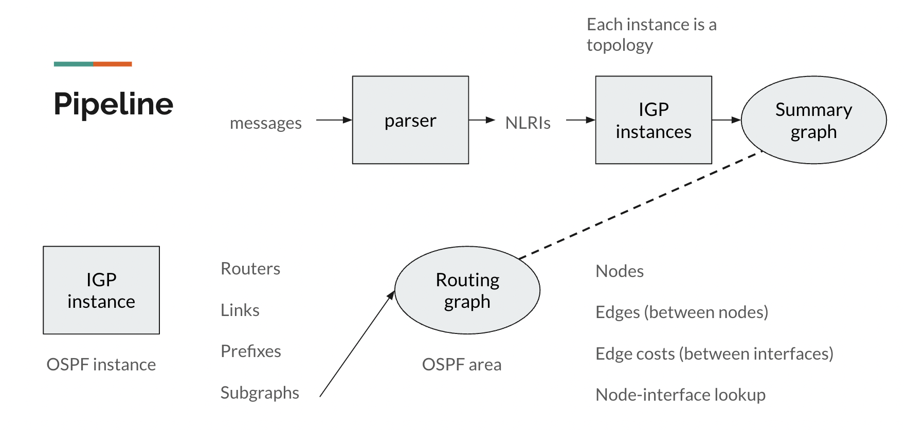
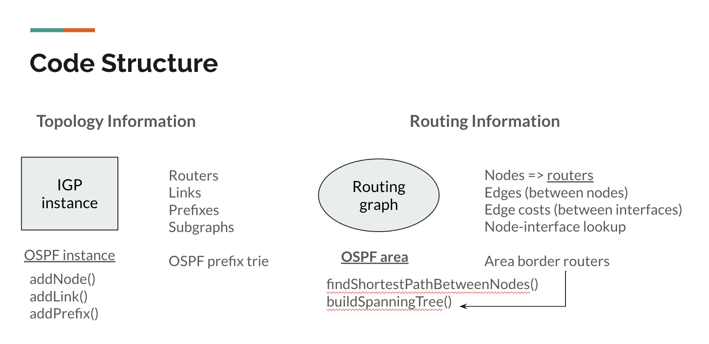
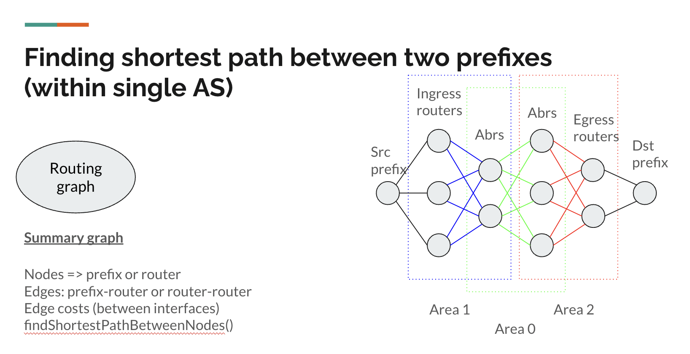

# BGPLS Monitor

## Background: BGP-LS

This project is designed to provide network visibility for systems utilizing the **BGP-LS** (Border Gateway Protocol - Link State) protocol. Border Gateway Protocol (**BGP**) enables routers to communicate and determine the best paths for routing traffic between autonomous systems (AS); Link State (**LS**) protocol is disseminates detailed network state information within an AS. By combining the capabilities of BGP and LS protocols, BGP-LS distributes information about multi-AS networks, which include network topology, traffic engineering details, and other information helpful for understanding and optimizing network behavior.

## Monitoring Server

Given the distributed nature of BGP-LS, individual BGP-LS speakers and receivers possess limited insights into the global network. Our monitoring server collects BGP-LS messages received from many different BGP-LS speakers, aggregating this data to construct a comprehensive global routing graph. Since BGP-LS supports various LS protocols and is quite extensible, the server uses a generalized graph representation of network topology, and accommodates scenarios where multiple LS protocols operate within a global network. This generalized form also simplifies the process of computing globally optimal routing paths.

## Current Usage

The project is still a work in progress. Currently, the server takes in a resource file that contains all the BGPLS messages; these messages are first parsed into JSON format using [exaBGP](https://github.com/Exa-Networks/exabgp). Launch the server with an unnamed argument `resourceName`, which should be the name of a JSON file, e.g. `dummydata/bgpls-example.json`. By default, the server runs on localhost 8080.

To find the shortest path between two network prefixes, use the POST API that takes in JSON data. Inside the JSON data,
the user needs to specify `bgplsId, as, protocolId, instanceId` to indicate which topology instance we are looking at, and pass in `ingressNetwork, egressNetwork` as source and destination network prefixes. For example,
```
curl -X POST -H "Content-Type: application/json" -d '{"bgplsId":"0","as":65530,"protocolId":3,"instanceId":0,"ingressNetwork":"10.0.0.12/30","egressNetwork":"10.0.1.4/30"}' http://localhost:8080/calculatePath
```
The server will return a result like this:
```
Path: src 10.0.0.12/30 -> 10.0.1.4/30
  hops: [10.0.0.12/30, 192.168.0.4, 192.168.0.101, 10.0.1.4/30]
  cost: 3.0
```

## Code Explanation







## Future Work

We identify three directions of future work:

1. Enhancing the efficiency of computing the shortest global path. Currently, this process involves computing numerous shortest paths within subgraphs, and we haven't been able to get optimization techniques such as shortest path trees to work. 

2. While our current implementation accommodates OSPF (Open Shortest Path First) as the LS protocol, our code, i.e. our generalized graph representation, is extensible to supporting IS-IS (Intermediate System to Intermediate System). 

3. One can implement segment routing as a BGP-LS extension using our current code as the foundation, which will be a significant improvement in functionality from our basic BGP-LS monitor.